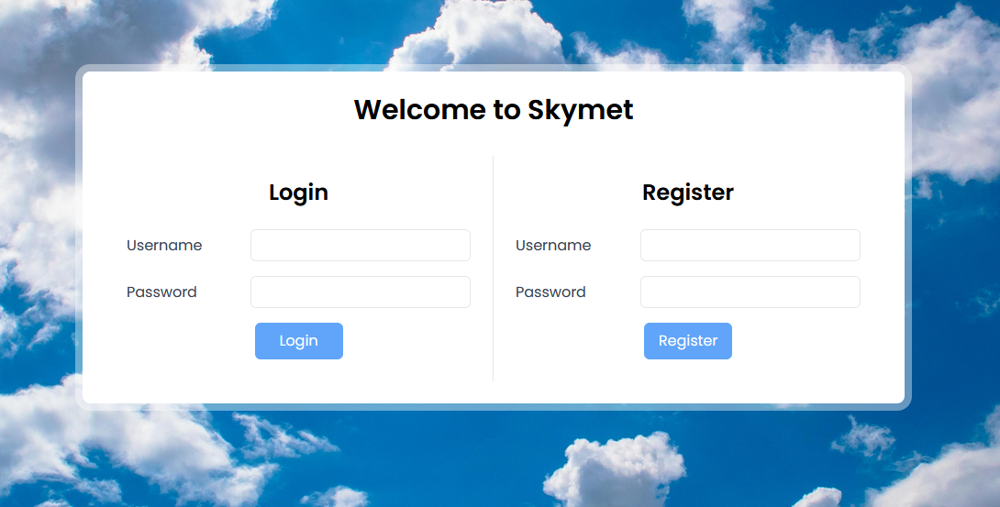
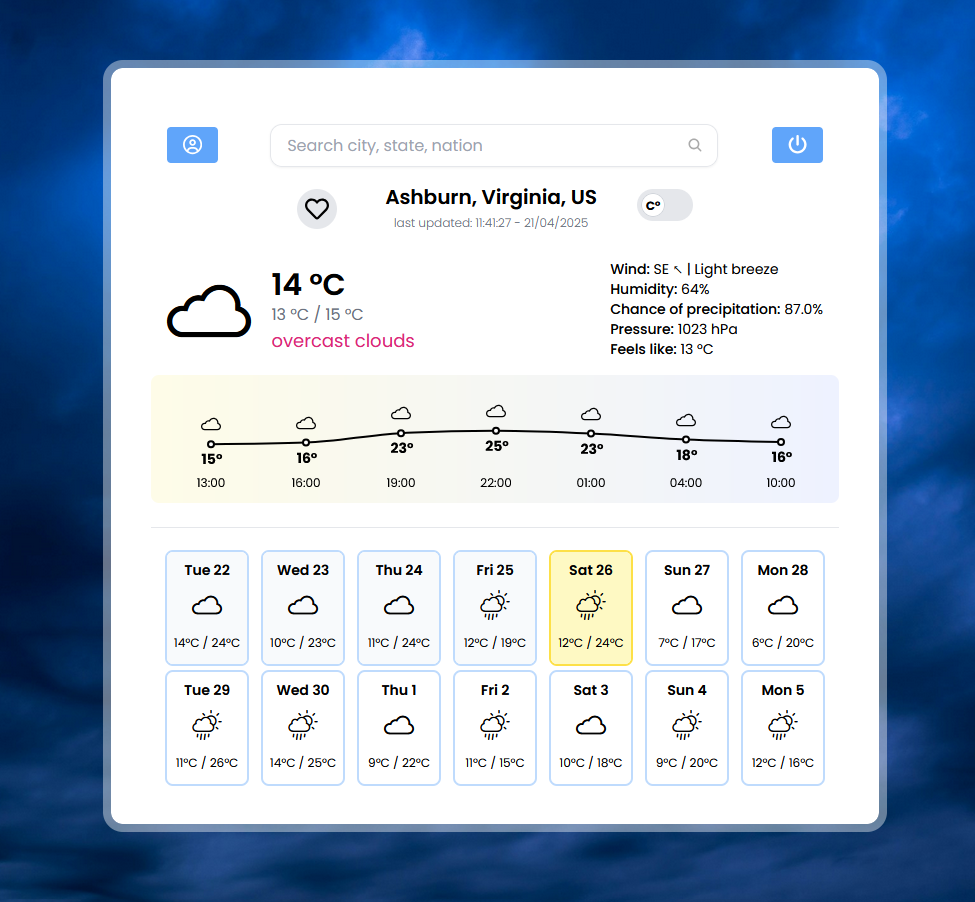

# Skymet - Full-Stack Weather Application

Skymet is a full-stack web application that provides real-time and forecasted weather data.
Built with a user-friendly interface, it allows users to access detailed weather insights,
save their favorite cities, and dynamically adapts based on user location.
It leverages interactive charts and icons, for a better understanding of weather trends.

This project is my **ITS graduation project** and also my **first ever** full-stack web application, demonstrating my proficiency in both backend and frontend technologies.

## Table of Contents

- [Current Status and Features](#current-status-and-features)
- [To Do](#to-do)
- [Languages and Frameworks](#languages-and-frameworks)
- [External APIs](#external-apis)
- [Installation](#installation)
- [Usage](#usage)
- [License](#license)
- [Preview](#preview)

## Current Status and Features

This project is actively being developed with the following features already completed and functioning:

- **Real-Time Weather Data**: The app successfully retrieves real-time weather information for any location.
- **Weather Forecasting**: Users can view weather forecasts for the upcoming days.
- **Interactive Visualizations**: Weather data is displayed using interactive charts and graphs (powered by Recharts) for easy analysis.
- **User Location Detection**: The app automatically detects the user's location using the IP-API service to provide localized weather data.
- **Favorite Cities**: Users can save and quickly access their favorite cities for efficient weather tracking.

Some enhancements are currently being worked on, including user profile management, dynamic backgrounds, and mobile app functionality.

## To Do

These are the features that are planned and are in development or on the roadmap for future releases:

- **🚧WIP!🚧 Statistics Page**: Display historical weather data for selected cities.
- **🚧WIP!🚧 User Profile Page**: Editable user profile with a more refined form design.
- **Autocomplete for Last Searched Cities**: Implement a FIFO array for the most recent cities searched.
- **🚧WIP!🚧 Dynamic Weather Backgrounds**: Add a feature that changes the background based on weather conditions (with smoother transitions).
- **Mobile App Version**: Developing a mobile app that will provide push notifications for real-time weather updates.
- **🚧WIP!🚧 Full User Registration**: User registration functionality with email verification and ability to update user information.
- **🚧WIP!🚧 Five-Day Forecasting**: Adding a detailed forecast for the next five days.

These features are planned for future versions of the app, and I am working on implementing them to further enhance the user experience.

### Languages and Frameworks

- **Backend:**
  Python, [Django](https://www.djangoproject.com/start/), [Django Rest Framework](https://www.django-rest-framework.org)
- **Frontend:** Javascript, [React](https://react.dev), [Vite](https://vite.dev)
- **Styling:** [Tailwind CSS](https://tailwindcss.com/docs/installation)
- **Data Visualization:** [Recharts](https://recharts.org/en-US/guide/getting-started)
- **Icons:** [Open Weather Icons](https://github.com/isneezy/open-weather-icons), [React Icons](https://react-icons.github.io/react-icons/)

### External APIs

This project uses the following external APIs:

- [OpenWeatherMap API](https://openweathermap.org/api)
- [IP-API](https://ip-api.com)

## Installation

### Prerequisites

Ensure the following are installed on your system:

- **Node.js**: [Download Node.js](https://nodejs.org) - this project uses v20.12.2
- **Python**: [Download Python](https://www.python.org) - this project uses v3.12.3
- **Package Managers**: npm (for frontend dependencies - v10.8.0 - comes with Node.js)
  and [pip](https://pip.pypa.io/en/stable/installation/) (for backend dependencies - v24.0)

### Step 1: Clone the Repository

```bash
git clone <repository-url>
cd Skymet
```

### Step 2: Create and activate the virtual environment

```bash
python3 -m venv .venv
```

On Windows:

```bash
.venv\Scripts\activate
```

On macOS/Linux:

```bash
source .venv/bin/activate
```

### Step 3: Install Frontend Dependencies

```bash
cd frontend
npm install
```

### Step 4: Install Backend Dependencies

```bash
pip install -r requirements.txt
```

### Step 5: Set Up Environment Variables

```makefile
OPENWEATHER_API_KEY=<your_openweathermap_api_key>
```

## Usage

### Start the Development Server

- **Frontend:**

  ```bash
  cd frontend
  npm run dev
  ```

- **Backend:**

  ```bash
  python manage.py runserver
  ```

- **Create a user:**
  Register to Skymet with the register form to start using the app

## License

This project is a school assignment and not for commercial use. For academic purposes only.

## Preview

### Login and register page



### Main page



### User profile page


