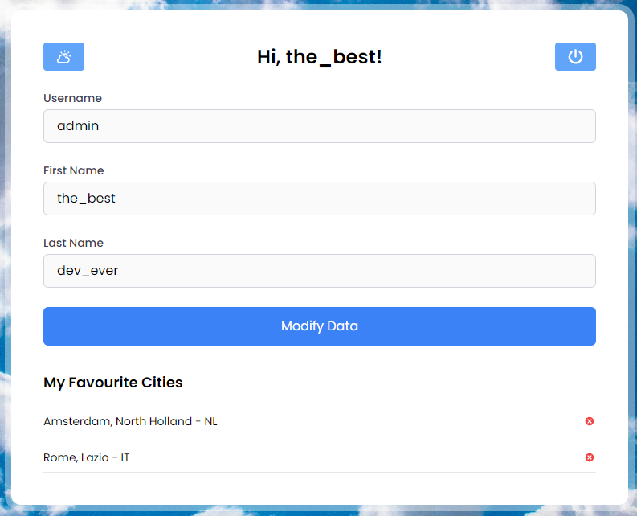

# Skymet

Skymet is a full-stack weather application that provides real-time and forecasted weather data in an intuitive and
user-friendly interface. The application integrates advanced weather visualization using charts and icons, and
dynamically adapts based on user location.

This project is being developed as my ITS Prodigi graduation project.

## Table of Contents

- [Features](#features)
- [To do](#to-do)
- [Installation](#installation)
- [Usage](#usage)
- [Languages and Frameworks](#languages-and-frameworks)
- [External APIs](#external-apis)
- [License](#license)
- [Preview](#preview)

## Features

- **Real-Time Weather Data**: Access real-time weather information.
- **Forecasts**: View detailed weather forecasts for various locations.
- **Interactive Visualizations**: Includes graphs and charts powered by Recharts for clear and engaging weather
  analysis.
- **Localization**: Automatically detects user location using IP-API.
- **Favorites**: Save your favorite cities to access the weather data more efficiently.

## To do

- **Statistics page**: Statistics page with historical city weather data.
- 🚧WIP!🚧 **User detail page**: User detail page with updateable form. | Add cuter form, grey readonly field and apply
  changes button
- **Autocomplete with last searched cities**: Insert FIFO array of last searched cities.
- 🚧WIP!🚧**Dynamic background**: background changes with weather. | Add cuter transition
- 🚧WIP!🚧**Responsiveness**: every action needs proper message/toast. | Make sure toast are everywhere
- **Favorites limit**: save a maximum of 5 favorite cities.
- **Mobile app**: mobile app with a proper notification system, so you can get automatic weather updates.
- 🚧WIP!🚧**Proper Registration:** email, update data, etc.
- **Five day forecasting**: add functionality where you can check out more data for next five days

## To fix

- Current city caching (IP API) when switching pages
- ✅DONE!✅~~chance of precipitation formatting~~
- ✅DONE!✅~~last update hour - day instead of day - hour~~
- Middle of current weather bar: weather alert (find weather alert api) or center current weather data

## Installation

### Prerequisites

Ensure the following are installed on your system:

- **Node.js**: [Download Node.js](https://nodejs.org) - this project uses v20.12.2
- **Python**: [Download Python](https://www.python.org) - this project uses v3.12.3
- **Package Managers**: npm (for frontend dependencies - v10.8.0 - comes with Node.js)
  and [pip](https://pip.pypa.io/en/stable/installation/) (for backend dependencies - v24.0)

### Step 1: Clone the Repository

```bash
git clone <repository-url>
cd Skymet
```

### Step 2: Create and activate the virtual environment

```bash
python3 -m venv .venv
```

On Windows:

```bash
.venv\Scripts\activate
```

On macOS/Linux:

```bash
source .venv/bin/activate
```

### Step 3: Install Frontend Dependencies

```bash
cd frontend
npm install
```

### Step 4: Install Backend Dependencies

```bash
pip install -r requirements.txt
```

### Step 5: Set Up Environment Variables

```makefile
OPENWEATHER_API_KEY=<your_openweathermap_api_key>
```

## Usage

### Start the Development Server

- **Frontend:**

  ```bash
  cd frontend
  npm run dev
  ```

- **Backend:**

  ```bash
  python manage.py runserver
  ```

- **Create a user:**
  Register to Skymet with the register form to start using the app

### Languages and Frameworks

- **Backend:**
  Python, [Django](https://www.djangoproject.com/start/), [Django Rest Framework](https://www.django-rest-framework.org)
- **Frontend:** Javascript, [React](https://react.dev), [Vite](https://vite.dev)
- **Styling:** [Tailwind CSS](https://tailwindcss.com/docs/installation)
- **Data Visualization:** [Recharts](https://recharts.org/en-US/guide/getting-started)
- **Icons:
  ** [Open Weather Icons](https://github.com/isneezy/open-weather-icons), [React Icons](https://react-icons.github.io/react-icons/)

### External APIs

This project uses the following external APIs:

- [OpenWeatherMap API](https://openweathermap.org/api)
- [IP-API](https://ip-api.com)

## License

This project is a school assignment and not for commercial use. For academic purposes only.

## Preview

### Login and register page


### Main page


### User profile page


